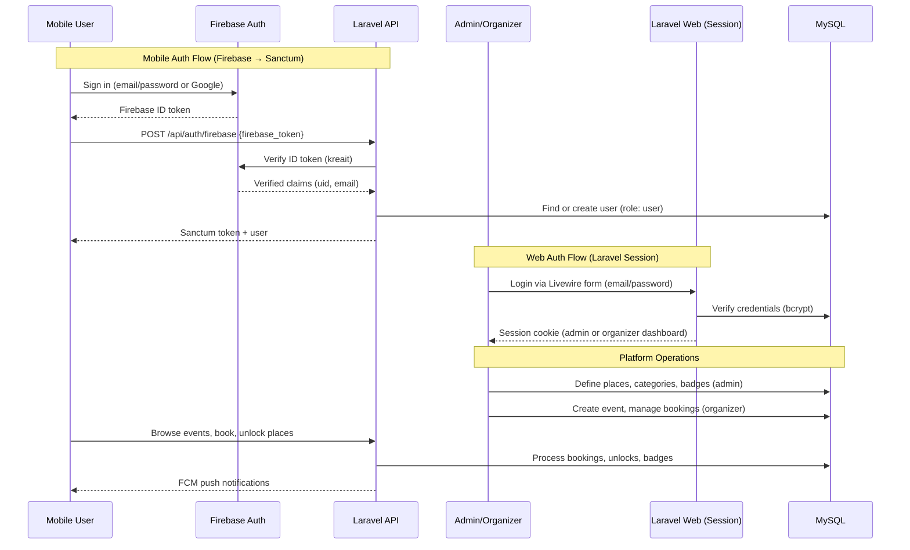

# Design Document: Travel Adventure Community Platform

## Overview

A Laravel-based travel adventure community platform combining event booking, social profiles, and gamified achievement tracking. Organizers create outdoor/travel events that users can browse and join. Users build a travel profile by unlocking places they've visited, earning badges, and climbing explorer levels.

**Platform scope:** Laravel serves the website (public pages), admin dashboard, organizer dashboard (all via Livewire/Volt/Flux), and a JSON API (Sanctum tokens) consumed by the mobile app.

**Infrastructure:**
- **Database:** MySQL (production), SQLite (local dev/testing)
- **Storage:** Amazon S3 for all file uploads (avatars, cover images, event photos, proof photos). Uses Laravel's `Storage::disk('s3')` facade.
- **Auth (Mobile API):** Firebase Authentication for email/password and Google login on mobile. The mobile app authenticates via Firebase SDK, sends the Firebase ID token to `POST /api/auth/firebase`, which is verified server-side via `kreait/laravel-firebase`. A Sanctum token is issued in return for subsequent API access. All `/api/*` routes are protected by `auth:sanctum` middleware.
- **Auth (Web Dashboards):** Admin (`/admin/*`) and Organizer (`/organizer/*`) web dashboards use Laravel's built-in session-based authentication (email/password). These routes use the standard `auth` middleware with Livewire/Volt/Flux views. No Firebase is involved for web dashboard login — admin and organizer accounts are managed entirely through Laravel's auth system (the existing login/register views).
- **Notifications:** Firebase Cloud Messaging (FCM) for push notifications to mobile devices (booking confirmations, approvals, event updates, badge awards). Web notifications via Laravel's database notification channel.

## Main Algorithm/Workflow



## Core Interfaces/Types

```php
// === ENUMS ===

enum UserRole: string
{
    case Admin = 'admin';
    case Organizer = 'organizer';
    case User = 'user';
}

enum PlaceCategory: string
{
    case Mountain = 'mountain';
    case Beach = 'beach';
    case Island = 'island';
    case Falls = 'falls';
    case River = 'river';
    case Lake = 'lake';
    case Campsite = 'campsite';
    case Historical = 'historical';
    case FoodDestination = 'food_destination';
    case RoadTrip = 'road_trip';
    case HiddenGem = 'hidden_gem';
}

enum EventStatus: string
{
    case Draft = 'draft';
    case Published = 'published';
    case Full = 'full';
    case Completed = 'completed';
    case Cancelled = 'cancelled';
}

enum BookingStatus: string
{
    case Pending = 'pending';
    case Approved = 'approved';
    case Rejected = 'rejected';
    case Cancelled = 'cancelled';
}

enum UnlockMethod: string
{
    case EventCompletion = 'event_completion';
    case PhotoProof = 'photo_proof';
    case SelfReport = 'self_report';
    case OrganizerVerification = 'organizer_verification';
    case AdminApproval = 'admin_approval';
    case QrCode = 'qr_code';
}

enum ExplorerLevel: string
{
    case BeginnerExplorer = 'beginner_explorer';
    case WeekendWanderer = 'weekend_wanderer';
    case TrailHunter = 'trail_hunter';
    case SummitCollector = 'summit_collector';
}
```

```php
// === ELOQUENT MODELS (key relationships & attributes) ===

// User model extends existing User
// Added fields: username, bio, avatar_path, role, firebase_uid,
//               google_id, explorer_level, is_verified_organizer
class User extends Authenticatable
{
    // Added fields: username, bio, avatar_path, role, firebase_uid,
    //               google_id, explorer_level, is_verified_organizer, fcm_token
    public function organizedEvents(): HasMany;       // Events this user organizes
    public function bookings(): HasMany;               // Event bookings
    public function unlockedPlaces(): BelongsToMany;   // pivot: place_unlocks
    public function badges(): BelongsToMany;           // pivot: user_badges
    public function followers(): BelongsToMany;        // pivot: follows
    public function following(): BelongsToMany;        // pivot: follows
    public function explorerLevel(): ExplorerLevel;    // computed from unlock count
}

class Place extends Model
{
    // id, name, slug, description, category (PlaceCategory), region,
    // province, latitude, longitude, cover_image_path,
    // category_fields (JSON - difficulty, meters_above_sea_level, etc.),
    // is_active, created_by (admin)
    public function events(): HasMany;
    public function unlockedByUsers(): BelongsToMany;  // pivot: place_unlocks
}

class Event extends Model
{
    // id, organizer_id, place_id, title, slug, description, category,
    // event_date, meeting_place, fee, max_slots, requirements (JSON),
    // status (EventStatus), auto_approve_bookings (bool)
    public function organizer(): BelongsTo;
    public function place(): BelongsTo;
    public function bookings(): HasMany;
    public function badges(): BelongsToMany;           // badges earnable at this event
    public function photos(): HasMany;                 // post-event photos
    public function availableSlots(): int;             // max_slots - approved bookings
}

class Booking extends Model
{
    // id, event_id, user_id, status (BookingStatus),
    // approved_at, rejected_at, notes
    public function event(): BelongsTo;
    public function user(): BelongsTo;
}

class PlaceUnlock extends Model
{
    // id, user_id, place_id, unlock_method (UnlockMethod),
    // proof_photo_path, verified_by (nullable user_id),
    // event_id (nullable), verified_at, notes
    public function user(): BelongsTo;
    public function place(): BelongsTo;
    public function event(): BelongsTo;
    public function verifiedBy(): BelongsTo;
}

class Badge extends Model
{
    // id, name, slug, description, icon_path, category (PlaceCategory nullable),
    // criteria_type (e.g. 'unlock_count', 'streak', 'region', 'event'),
    // criteria_value (JSON), is_active
    public function users(): BelongsToMany;            // pivot: user_badges
    public function events(): BelongsToMany;           // events that award this badge
}

class EventPhoto extends Model
{
    // id, event_id, uploaded_by, photo_path, caption
    public function event(): BelongsTo;
    public function uploader(): BelongsTo;
}
```

## Key Functions with Formal Specifications

### Function 1: bookEvent()

```php
class BookingService
{
    public function bookEvent(User $user, Event $event): Booking;
}
```

**Preconditions:**
- `$user` is authenticated and has role `User`
- `$event->status` is `Published` (not Draft, Full, Completed, or Cancelled)
- `$event->availableSlots() > 0`
- `$user` does not already have an active booking (Pending or Approved) for this event
- `$event->event_date` is in the future

**Postconditions:**
- A new `Booking` record is created with status `Pending` (or `Approved` if `$event->auto_approve_bookings`)
- If auto-approved, `$event->availableSlots()` decreases by 1
- If `$event->availableSlots() === 0` after booking, `$event->status` becomes `Full`
- Returns the created `Booking` instance
- No mutation to `$user` or `$event` fields other than status

**Loop Invariants:** N/A

---

### Function 2: approveBooking()

```php
class BookingService
{
    public function approveBooking(User $organizer, Booking $booking): Booking;
}
```

**Preconditions:**
- `$organizer->id === $booking->event->organizer_id`
- `$booking->status` is `Pending`
- `$booking->event->availableSlots() > 0`

**Postconditions:**
- `$booking->status` becomes `Approved`, `approved_at` is set
- `$booking->event->availableSlots()` decreases by 1
- If `availableSlots() === 0`, event status becomes `Full`
- Returns updated `Booking`

**Loop Invariants:** N/A

---

### Function 3: unlockPlace()

```php
class UnlockService
{
    public function unlockPlace(
        User $user,
        Place $place,
        UnlockMethod $method,
        ?string $proofPhotoPath = null,
        ?Event $event = null,
        ?User $verifier = null
    ): PlaceUnlock;
}
```

**Preconditions:**
- `$user` is authenticated
- `$place->is_active === true`
- User has not already unlocked this place (`place_unlocks` has no record for user+place)
- If `$method === PhotoProof`, then `$proofPhotoPath` is non-null and file exists
- If `$method === EventCompletion`, then `$event` is non-null, event status is `Completed`, and user has an `Approved` booking for that event
- If `$method === OrganizerVerification`, then `$verifier` is the event organizer
- If `$method === AdminApproval`, then `$verifier->role === Admin`

**Postconditions:**
- A new `PlaceUnlock` record is created
- `$user->unlockedPlaces` count increases by 1
- `$user->explorerLevel()` is recalculated
- Badge eligibility is checked and new badges awarded if criteria met
- Returns the created `PlaceUnlock`

**Loop Invariants:** N/A

---

### Function 4: completeEvent()

```php
class EventService
{
    public function completeEvent(User $organizer, Event $event): Event;
}
```

**Preconditions:**
- `$organizer->id === $event->organizer_id`
- `$event->status` is `Published` or `Full`
- `$event->event_date` is in the past or today

**Postconditions:**
- `$event->status` becomes `Completed`
- For each booking with status `Approved`: place is auto-unlocked via `EventCompletion` method (if not already unlocked)
- Event-specific badges are awarded to all approved attendees who meet criteria
- Returns updated `Event`

**Loop Invariants:**
- During attendee iteration: all previously processed attendees have their unlock and badge records created
- Total unlocks created <= total approved bookings

---

### Function 5: calculateExplorerLevel()

```php
class AchievementService
{
    public function calculateExplorerLevel(User $user): ExplorerLevel;
}
```

**Preconditions:**
- `$user` exists in database

**Postconditions:**
- Returns `ExplorerLevel` based on total unlocked places count:
  - 0-4 unlocks → `BeginnerExplorer`
  - 5-14 unlocks → `WeekendWanderer`
  - 15-29 unlocks → `TrailHunter`
  - 30+ unlocks → `SummitCollector`
- No side effects, pure computation

**Loop Invariants:** N/A

---

### Function 6: checkAndAwardBadges()

```php
class AchievementService
{
    public function checkAndAwardBadges(User $user): Collection;
}
```

**Preconditions:**
- `$user` exists with loaded `unlockedPlaces` and `badges` relationships

**Postconditions:**
- Evaluates all active badges against user's current stats
- Awards any badges whose criteria are met but not yet awarded
- Returns collection of newly awarded badges (may be empty)
- Does not remove previously awarded badges
- Each badge awarded exactly once (idempotent)

**Loop Invariants:**
- During badge iteration: no duplicate `user_badges` records created
- Previously awarded badges remain unchanged

## Algorithmic Pseudocode

### Mobile Firebase Auth Flow (API Only)

```php
// AuthController::firebaseLogin — POST /api/auth/firebase
// This endpoint is used ONLY by the mobile app.
// Mobile users authenticate via Firebase SDK, then send the Firebase ID token here
// to receive a Sanctum token for subsequent API calls.
public function firebaseLogin(Request $request): JsonResponse
{
    $firebaseToken = $request->input('firebase_token');

    // Verify Firebase ID token via kreait/laravel-firebase
    $auth = app('firebase.auth');
    $verifiedToken = $auth->verifyIdToken($firebaseToken);
    $firebaseUid = $verifiedToken->claims()->get('sub');
    $email = $verifiedToken->claims()->get('email');
    $googleId = $verifiedToken->claims()->get('firebase')['identities']['google.com'][0] ?? null;

    // Find or create local user (mobile users always get 'user' role)
    $user = User::firstOrCreate(
        ['firebase_uid' => $firebaseUid],
        [
            'name' => $verifiedToken->claims()->get('name') ?? $email,
            'email' => $email,
            'username' => Str::slug(explode('@', $email)[0]) . '-' . Str::random(4),
            'google_id' => $googleId,
            'role' => UserRole::User,
        ]
    );

    // Issue Sanctum token for API access
    $token = $user->createToken('mobile-app')->plainTextToken;

    return response()->json(['token' => $token, 'user' => $user]);
}

// NOTE: Admin and Organizer accounts do NOT use Firebase.
// They log in via Laravel's built-in session auth (Livewire login/register views)
// and access /admin/* and /organizer/* web routes protected by 'auth' middleware.
```

### FCM Notification Helper

```php
// NotificationService — sends push via Firebase Cloud Messaging
class NotificationService
{
    public function sendPush(User $user, string $title, string $body, array $data = []): void
    {
        if (!$user->fcm_token) return;

        $messaging = app('firebase.messaging');
        $message = CloudMessage::withTarget('token', $user->fcm_token)
            ->withNotification(Notification::create($title, $body))
            ->withData($data);

        $messaging->send($message);
    }

    // Called after booking created
    public function notifyBookingCreated(Booking $booking): void
    {
        $this->sendPush(
            $booking->event->organizer,
            'New Booking',
            "{$booking->user->username} booked {$booking->event->title}",
            ['type' => 'booking_created', 'booking_id' => $booking->id]
        );
    }

    // Called after booking approved/rejected
    public function notifyBookingStatusChanged(Booking $booking): void
    {
        $this->sendPush(
            $booking->user,
            'Booking ' . ucfirst($booking->status->value),
            "Your booking for {$booking->event->title} was {$booking->status->value}",
            ['type' => 'booking_status', 'booking_id' => $booking->id]
        );
    }

    // Called after badge awarded
    public function notifyBadgeAwarded(User $user, Badge $badge): void
    {
        $this->sendPush(
            $user,
            'Badge Unlocked!',
            "You earned the {$badge->name} badge",
            ['type' => 'badge_awarded', 'badge_id' => $badge->id]
        );
    }
}
```

### S3 File Upload Helper

```php
// All file uploads use S3 via Laravel Storage facade
// config/filesystems.php: default disk = 's3' in production

// Upload avatar
$path = Storage::disk('s3')->putFile('avatars', $request->file('avatar'), 'public');
$user->update(['avatar_path' => $path]);

// Upload event photo
$path = Storage::disk('s3')->putFile('event-photos', $request->file('photo'), 'public');
EventPhoto::create([...,'photo_path' => $path]);

// Upload proof photo for place unlock
$path = Storage::disk('s3')->putFile('proof-photos', $request->file('proof'), 'public');

// Get public URL
$url = Storage::disk('s3')->url($path);
```

### Event Booking Algorithm

```php
// BookingService::bookEvent
public function bookEvent(User $user, Event $event): Booking
{
    // ASSERT: user is authenticated, event is published, slots available, no duplicate booking
    DB::transaction(function () use ($user, $event, &$booking) {
        // Lock event row to prevent race conditions on slot count
        $event = Event::lockForUpdate()->find($event->id);

        $availableSlots = $event->max_slots - $event->bookings()
            ->whereIn('status', [BookingStatus::Pending, BookingStatus::Approved])
            ->count();

        if ($availableSlots <= 0) {
            throw new NoSlotsAvailableException();
        }

        $status = $event->auto_approve_bookings
            ? BookingStatus::Approved
            : BookingStatus::Pending;

        $booking = Booking::create([
            'event_id' => $event->id,
            'user_id' => $user->id,
            'status' => $status,
            'approved_at' => $status === BookingStatus::Approved ? now() : null,
        ]);

        // Recount after insert
        $newAvailable = $event->max_slots - $event->bookings()
            ->whereIn('status', [BookingStatus::Pending, BookingStatus::Approved])
            ->count();

        if ($newAvailable <= 0) {
            $event->update(['status' => EventStatus::Full]);
        }
    });

    // ASSERT: booking created, slot count consistent
    return $booking;
}
```

### Event Completion & Auto-Unlock Algorithm

```php
// EventService::completeEvent
public function completeEvent(User $organizer, Event $event): Event
{
    // ASSERT: organizer owns event, event is Published/Full, date is past/today
    DB::transaction(function () use ($event) {
        $event->update(['status' => EventStatus::Completed]);

        $approvedBookings = $event->bookings()
            ->where('status', BookingStatus::Approved)
            ->with('user')
            ->get();

        // LOOP INVARIANT: all previously processed attendees have unlock records
        foreach ($approvedBookings as $booking) {
            $alreadyUnlocked = PlaceUnlock::where('user_id', $booking->user_id)
                ->where('place_id', $event->place_id)
                ->exists();

            if (!$alreadyUnlocked) {
                $this->unlockService->unlockPlace(
                    user: $booking->user,
                    place: $event->place,
                    method: UnlockMethod::EventCompletion,
                    event: $event,
                );
            }
        }
    });

    return $event->fresh();
}
```

### Badge Evaluation Algorithm

```php
// AchievementService::checkAndAwardBadges
public function checkAndAwardBadges(User $user): Collection
{
    $newBadges = collect();
    $existingBadgeIds = $user->badges()->pluck('badges.id');
    $candidateBadges = Badge::where('is_active', true)
        ->whereNotIn('id', $existingBadgeIds)
        ->get();

    $unlockStats = $this->getUserUnlockStats($user);

    // LOOP INVARIANT: no duplicate user_badges created, newBadges only contains newly awarded
    foreach ($candidateBadges as $badge) {
        if ($this->meetsCriteria($badge, $unlockStats)) {
            $user->badges()->attach($badge->id, ['awarded_at' => now()]);
            $newBadges->push($badge);
        }
    }

    // Recalculate explorer level
    $newLevel = $this->calculateExplorerLevel($user);
    if ($user->explorer_level !== $newLevel) {
        $user->update(['explorer_level' => $newLevel]);
    }

    return $newBadges;
}

private function meetsCriteria(Badge $badge, array $stats): bool
{
    return match ($badge->criteria_type) {
        'unlock_count' => $stats['total'] >= $badge->criteria_value['count'],
        'category_count' => ($stats['by_category'][$badge->criteria_value['category']] ?? 0)
            >= $badge->criteria_value['count'],
        'region_count' => ($stats['by_region'][$badge->criteria_value['region']] ?? 0)
            >= $badge->criteria_value['count'],
        'streak' => $stats['current_streak'] >= $badge->criteria_value['days'],
        default => false,
    };
}
```

## Example Usage

```php
// === 1. Admin creates a place ===
$place = Place::create([
    'name' => 'Mt. Pulag',
    'slug' => 'mt-pulag',
    'description' => 'Third highest mountain in the Philippines',
    'category' => PlaceCategory::Mountain,
    'region' => 'Cordillera',
    'province' => 'Benguet',
    'latitude' => 16.5870,
    'longitude' => 120.8830,
    'category_fields' => [
        'difficulty' => 'moderate',
        'meters_above_sea_level' => 2922,
        'trail_class' => 3,
        'estimated_hours' => 6,
    ],
    'is_active' => true,
    'created_by' => $admin->id,
]);

// === 2. Organizer creates an event ===
$event = Event::create([
    'organizer_id' => $organizer->id,
    'place_id' => $place->id,
    'title' => 'Mt. Pulag Sea of Clouds Adventure',
    'slug' => 'mt-pulag-sea-of-clouds-2025',
    'description' => 'Witness the famous sea of clouds at the summit.',
    'category' => PlaceCategory::Mountain,
    'event_date' => '2025-08-15',
    'meeting_place' => 'Baguio City, Session Road',
    'fee' => 3500.00,
    'max_slots' => 20,
    'requirements' => ['valid_id', 'medical_certificate', 'waiver'],
    'status' => EventStatus::Published,
    'auto_approve_bookings' => false,
]);
$event->badges()->attach([$summitBadge->id, $cordilleraBadge->id]);

// === 3. User books the event ===
$bookingService = app(BookingService::class);
$booking = $bookingService->bookEvent($user, $event);
// $booking->status === BookingStatus::Pending

// === 4. Organizer approves ===
$booking = $bookingService->approveBooking($organizer, $booking);
// $booking->status === BookingStatus::Approved

// === 5. After the trip, organizer completes event ===
$eventService = app(EventService::class);
$eventService->completeEvent($organizer, $event);
// All approved attendees auto-unlock Mt. Pulag
// Badges checked and awarded

// === 6. User views their profile ===
$profile = [
    'username' => $user->username,
    'explorer_level' => $user->explorer_level,        // e.g. WeekendWanderer
    'unlocked_places' => $user->unlockedPlaces->count(), // e.g. 8
    'badges' => $user->badges->pluck('name'),          // ['Summit Seeker', 'Cordillera Explorer']
    'stats' => [
        'mountains' => $user->unlockedPlaces->where('category', 'mountain')->count(),
        'beaches' => $user->unlockedPlaces->where('category', 'beach')->count(),
        'islands' => $user->unlockedPlaces->where('category', 'island')->count(),
        'falls' => $user->unlockedPlaces->where('category', 'falls')->count(),
    ],
];

// === 7. API endpoints for mobile (auth:sanctum) ===
// Mobile users authenticate via: Firebase SDK → POST /api/auth/firebase → Sanctum token
// GET /api/events — browse events
// POST /api/events/{event}/book — book an event
// GET /api/profile/{username} — view travel profile
// POST /api/places/{place}/unlock — submit unlock proof
// GET /api/leaderboard — top explorers

// === 8. Web dashboard routes (Laravel session auth) ===
// Admin/Organizer log in via Livewire auth views (email/password, no Firebase)
// GET /admin/dashboard — admin dashboard
// GET /admin/places — manage places
// GET /organizer/dashboard — organizer dashboard
// GET /organizer/events — manage events
```

## Database Schema (Migrations)

```php
// places
Schema::create('places', function (Blueprint $table) {
    $table->id();
    $table->string('name');
    $table->string('slug')->unique();
    $table->text('description')->nullable();
    $table->string('category');           // PlaceCategory enum
    $table->string('region')->nullable();
    $table->string('province')->nullable();
    $table->decimal('latitude', 10, 7)->nullable();
    $table->decimal('longitude', 10, 7)->nullable();
    $table->string('cover_image_path')->nullable();
    $table->json('category_fields')->nullable(); // flexible per-category attributes
    $table->boolean('is_active')->default(true);
    $table->foreignId('created_by')->constrained('users');
    $table->timestamps();
    $table->index(['category', 'region']);
});

// events
Schema::create('events', function (Blueprint $table) {
    $table->id();
    $table->foreignId('organizer_id')->constrained('users');
    $table->foreignId('place_id')->constrained('places');
    $table->string('title');
    $table->string('slug')->unique();
    $table->text('description')->nullable();
    $table->string('category');
    $table->date('event_date');
    $table->string('meeting_place')->nullable();
    $table->decimal('fee', 10, 2)->default(0);
    $table->unsignedInteger('max_slots');
    $table->json('requirements')->nullable();
    $table->string('status')->default('draft');
    $table->boolean('auto_approve_bookings')->default(false);
    $table->timestamps();
    $table->index(['status', 'event_date']);
});

// bookings
Schema::create('bookings', function (Blueprint $table) {
    $table->id();
    $table->foreignId('event_id')->constrained('events')->cascadeOnDelete();
    $table->foreignId('user_id')->constrained('users')->cascadeOnDelete();
    $table->string('status')->default('pending');
    $table->timestamp('approved_at')->nullable();
    $table->timestamp('rejected_at')->nullable();
    $table->text('notes')->nullable();
    $table->timestamps();
    $table->unique(['event_id', 'user_id']);
});

// place_unlocks
Schema::create('place_unlocks', function (Blueprint $table) {
    $table->id();
    $table->foreignId('user_id')->constrained('users')->cascadeOnDelete();
    $table->foreignId('place_id')->constrained('places')->cascadeOnDelete();
    $table->string('unlock_method');
    $table->string('proof_photo_path')->nullable();
    $table->foreignId('verified_by')->nullable()->constrained('users')->nullOnDelete();
    $table->foreignId('event_id')->nullable()->constrained('events')->nullOnDelete();
    $table->timestamp('verified_at')->nullable();
    $table->text('notes')->nullable();
    $table->timestamps();
    $table->unique(['user_id', 'place_id']);
});

// badges
Schema::create('badges', function (Blueprint $table) {
    $table->id();
    $table->string('name');
    $table->string('slug')->unique();
    $table->text('description')->nullable();
    $table->string('icon_path')->nullable();
    $table->string('category')->nullable();
    $table->string('criteria_type');       // unlock_count, category_count, region_count, streak
    $table->json('criteria_value');        // {"count": 10} or {"category": "mountain", "count": 5}
    $table->boolean('is_active')->default(true);
    $table->timestamps();
});

// user_badges (pivot)
Schema::create('user_badges', function (Blueprint $table) {
    $table->id();
    $table->foreignId('user_id')->constrained('users')->cascadeOnDelete();
    $table->foreignId('badge_id')->constrained('badges')->cascadeOnDelete();
    $table->timestamp('awarded_at');
    $table->unique(['user_id', 'badge_id']);
});

// badge_event (pivot - which badges an event can award)
Schema::create('badge_event', function (Blueprint $table) {
    $table->foreignId('badge_id')->constrained()->cascadeOnDelete();
    $table->foreignId('event_id')->constrained()->cascadeOnDelete();
    $table->primary(['badge_id', 'event_id']);
});

// event_photos
Schema::create('event_photos', function (Blueprint $table) {
    $table->id();
    $table->foreignId('event_id')->constrained('events')->cascadeOnDelete();
    $table->foreignId('uploaded_by')->constrained('users');
    $table->string('photo_path');
    $table->string('caption')->nullable();
    $table->timestamps();
});

// follows (user follow system)
Schema::create('follows', function (Blueprint $table) {
    $table->foreignId('follower_id')->constrained('users')->cascadeOnDelete();
    $table->foreignId('following_id')->constrained('users')->cascadeOnDelete();
    $table->primary(['follower_id', 'following_id']);
    $table->timestamps();
});

// users table additions (alter existing)
Schema::table('users', function (Blueprint $table) {
    $table->string('username')->unique()->after('name');
    $table->text('bio')->nullable()->after('username');
    $table->string('avatar_path')->nullable()->after('bio');
    $table->string('role')->default('user')->after('avatar_path');
    $table->string('firebase_uid')->nullable()->unique()->after('role');
    $table->string('google_id')->nullable()->after('firebase_uid');
    $table->string('explorer_level')->default('beginner_explorer')->after('google_id');
    $table->boolean('is_verified_organizer')->default(false)->after('explorer_level');
    $table->string('fcm_token')->nullable()->after('is_verified_organizer');
});
```

## API Routes (Mobile — Sanctum Token Auth)

```php
// routes/api.php
// All API routes are consumed by the mobile app.
// Authentication: Firebase ID token → POST /api/auth/firebase → Sanctum token.
// All authenticated endpoints require 'auth:sanctum' middleware.

// Public auth endpoint — mobile Firebase login
Route::post('/auth/firebase', [AuthController::class, 'firebaseLogin']);

Route::middleware('auth:sanctum')->group(function () {
    // Events
    Route::get('/events', [EventController::class, 'index']);
    Route::get('/events/{event:slug}', [EventController::class, 'show']);
    Route::post('/events/{event}/book', [BookingController::class, 'store']);
    Route::delete('/bookings/{booking}', [BookingController::class, 'cancel']);

    // Organizer (mobile organizer actions via API)
    Route::middleware('role:organizer')->group(function () {
        Route::post('/events/{event}/complete', [EventController::class, 'complete']);
        Route::post('/bookings/{booking}/approve', [BookingController::class, 'approve']);
        Route::post('/bookings/{booking}/reject', [BookingController::class, 'reject']);
        Route::post('/events/{event}/photos', [EventPhotoController::class, 'store']);
    });

    // Places & Unlocks
    Route::get('/places', [PlaceController::class, 'index']);
    Route::get('/places/{place:slug}', [PlaceController::class, 'show']);
    Route::post('/places/{place}/unlock', [PlaceUnlockController::class, 'store']);

    // Profile
    Route::get('/profile/{user:username}', [ProfileController::class, 'show']);
    Route::get('/profile/{user:username}/unlocks', [ProfileController::class, 'unlocks']);
    Route::get('/profile/{user:username}/badges', [ProfileController::class, 'badges']);

    // Social
    Route::post('/users/{user}/follow', [FollowController::class, 'store']);
    Route::delete('/users/{user}/unfollow', [FollowController::class, 'destroy']);

    // Achievements & Leaderboard
    Route::get('/leaderboard', [LeaderboardController::class, 'index']);
    Route::get('/badges', [BadgeController::class, 'index']);

    // FCM token registration
    Route::post('/auth/fcm-token', [AuthController::class, 'updateFcmToken']);
});
```

## Web Routes (Admin & Organizer Dashboards — Laravel Session Auth)

```php
// routes/web.php
// Admin and Organizer dashboards use Laravel's built-in session-based auth.
// Login/register via existing Livewire auth views (email/password only, NO Firebase).
// Protected by 'auth' middleware (session-based).

// Admin dashboard routes
Route::middleware(['auth', 'role:admin'])->prefix('admin')->group(function () {
    Route::get('/dashboard', [AdminDashboardController::class, 'index'])->name('admin.dashboard');
    Route::resource('/places', AdminPlaceController::class)->names('admin.places');
    Route::resource('/badges', AdminBadgeController::class)->names('admin.badges');
    Route::post('/organizers/{user}/verify', [AdminOrganizerController::class, 'verify'])->name('admin.organizers.verify');
    Route::get('/organizers', [AdminOrganizerController::class, 'index'])->name('admin.organizers.index');
});

// Organizer dashboard routes
Route::middleware(['auth', 'role:organizer'])->prefix('organizer')->group(function () {
    Route::get('/dashboard', [OrganizerDashboardController::class, 'index'])->name('organizer.dashboard');
    Route::resource('/events', OrganizerEventController::class)->names('organizer.events');
    Route::post('/events/{event}/publish', [OrganizerEventController::class, 'publish'])->name('organizer.events.publish');
    Route::post('/events/{event}/complete', [OrganizerEventController::class, 'complete'])->name('organizer.events.complete');
    Route::get('/events/{event}/bookings', [OrganizerBookingController::class, 'index'])->name('organizer.bookings.index');
    Route::post('/bookings/{booking}/approve', [OrganizerBookingController::class, 'approve'])->name('organizer.bookings.approve');
    Route::post('/bookings/{booking}/reject', [OrganizerBookingController::class, 'reject'])->name('organizer.bookings.reject');
    Route::post('/events/{event}/photos', [OrganizerEventPhotoController::class, 'store'])->name('organizer.events.photos.store');
});
```

## Correctness Properties

*A property is a characteristic or behavior that should hold true across all valid executions of a system — essentially, a formal statement about what the system should do. Properties serve as the bridge between human-readable specifications and machine-verifiable correctness guarantees.*

### Property 1: Explorer level is determined by unlock count thresholds

*For any* non-negative integer representing a user's total unlocked places count, `calculateExplorerLevel` SHALL return `beginner_explorer` for 0–4, `weekend_wanderer` for 5–14, `trail_hunter` for 15–29, and `summit_collector` for 30+. The thresholds are exhaustive and mutually exclusive — every count maps to exactly one level.

**Validates: Requirements 8.1, 8.2, 8.3, 8.4**

### Property 2: Booking a published event with available slots produces a valid booking

*For any* published event with at least one available slot and *for any* user without an existing active booking for that event, calling `bookEvent` SHALL produce a booking with status `pending` (or `approved` if `auto_approve_bookings` is true), and the event's available slot count SHALL decrease by one.

**Validates: Requirements 4.1, 4.2**

### Property 3: Event status becomes Full when available slots reach zero

*For any* event where a booking creation or booking approval causes the available slot count to reach zero, the EventStatus SHALL be updated to `full`.

**Validates: Requirements 4.3, 5.3**

### Property 4: Duplicate bookings are rejected

*For any* user who already has a pending or approved booking for an event, a subsequent booking attempt for the same event SHALL be rejected, and the bookings table SHALL contain at most one active record per (event_id, user_id) pair.

**Validates: Requirements 4.5, 17.1**

### Property 5: Booking a full event is rejected

*For any* event with zero available slots, *for any* user, calling `bookEvent` SHALL raise a NoSlotsAvailableException and create no new booking record.

**Validates: Requirement 4.4**

### Property 6: Only the event owner can approve or reject bookings

*For any* booking and *for any* user who is not the event's organizer, attempting to approve or reject that booking SHALL be rejected. Only the user whose ID matches `booking.event.organizer_id` can change booking status.

**Validates: Requirement 5.5**

### Property 7: Booking approval and rejection set correct status and timestamps

*For any* pending booking owned by the organizer, approving it SHALL set status to `approved` and `approved_at` to a non-null timestamp. Rejecting it SHALL set status to `rejected` and `rejected_at` to a non-null timestamp.

**Validates: Requirements 5.1, 5.2**

### Property 8: Event completion auto-unlocks places for all approved attendees

*For any* completed event with N approved bookings where K attendees have already unlocked the event's place, exactly (N - K) new PlaceUnlock records with method `event_completion` SHALL be created. No attendee receives a duplicate unlock.

**Validates: Requirements 6.1, 6.2**

### Property 9: Only the event owner can complete an event, and only for past/today dates

*For any* event and *for any* user who is not the organizer, completion SHALL be rejected. *For any* event with a future event_date, completion SHALL be rejected regardless of who requests it.

**Validates: Requirements 6.4, 6.5**

### Property 10: Duplicate place unlocks are rejected

*For any* user-place pair that already has a PlaceUnlock record, a subsequent unlock attempt SHALL be rejected, preserving the unique constraint on (user_id, place_id).

**Validates: Requirements 7.3, 7.9, 17.2**

### Property 11: Unlock method preconditions are enforced

*For any* unlock attempt via `event_completion`, the event must have status `completed` and the user must have an approved booking. *For any* unlock via `organizer_verification`, the verifier must be the event organizer. *For any* unlock via `admin_approval`, the verifier must have the `admin` role. Violations of these preconditions SHALL be rejected.

**Validates: Requirements 7.5, 7.6, 7.7**

### Property 12: Unlocking a place triggers level recalculation and badge evaluation

*For any* successful place unlock, the user's ExplorerLevel SHALL be recalculated based on their new total unlock count, and `checkAndAwardBadges` SHALL be invoked. If the new unlock count crosses a level threshold, the user's `explorer_level` field SHALL be updated.

**Validates: Requirements 7.8, 8.5**

### Property 13: Badge awarding is idempotent and monotonic

*For any* user, calling `checkAndAwardBadges` multiple times with the same unlock statistics SHALL result in exactly the same set of awarded badges — no duplicates created, no previously awarded badges removed. The set of awarded badges only grows over time.

**Validates: Requirements 9.6, 9.7, 17.3**

### Property 14: Badge criteria evaluation matches the criteria type

*For any* active badge with criteria_type `unlock_count` and a user whose total unlocks >= the criteria count, the badge SHALL be awarded. *For any* badge with `category_count`, the user's unlocks in the specified category must meet the count. *For any* badge with `region_count`, the user's unlocks in the specified region must meet the count. *For any* badge with `streak`, the user's current streak must meet the days threshold.

**Validates: Requirements 9.2, 9.3, 9.4, 9.5**

### Property 15: Deactivated places are excluded from public browsing

*For any* set of places where some have `is_active = false`, the public browse/search results SHALL contain only active places. No inactive place SHALL appear in user-facing queries.

**Validates: Requirement 2.4**

### Property 16: Deactivated badges are excluded from evaluation

*For any* badge with `is_active = false`, the AchievementService SHALL skip it during badge evaluation. Deactivated badges SHALL not be newly awarded to any user.

**Validates: Requirement 15.2**

### Property 17: Event browsing returns only published or full events

*For any* set of events with mixed statuses (draft, published, full, completed, cancelled), the public browse endpoint SHALL return only events with status `published` or `full`.

**Validates: Requirement 3.5**

### Property 18: Follow/unfollow round-trip

*For any* two distinct users A and B, if A follows B and then A unfollows B, the follows table SHALL contain no record for that pair — restoring the original state. A user SHALL not be able to follow themselves.

**Validates: Requirements 10.2, 10.3, 10.5, 10.6, 17.4**

### Property 19: Unique slug enforcement across entities

*For any* two places with the same slug, the second creation SHALL fail. The same constraint applies to events and badges — each entity type enforces slug uniqueness independently.

**Validates: Requirements 2.5, 3.4, 15.4**

### Property 20: PlaceCategory validation

*For any* string value assigned as a place category, the Platform SHALL accept it only if it is one of the 11 defined PlaceCategory values. Any other value SHALL be rejected.

**Validates: Requirement 2.2**

### Property 21: Notifications are sent for booking and badge events, gracefully handling missing FCM tokens

*For any* booking creation, an FCM notification SHALL be sent to the organizer. *For any* booking approval or rejection, an FCM notification SHALL be sent to the user. *For any* badge award, an FCM notification SHALL be sent to the user. *For any* user with a null `fcm_token`, the NotificationService SHALL skip the push without error.

**Validates: Requirements 4.8, 5.4, 9.8, 13.1, 13.2, 13.3, 13.4**

### Property 22: Role-based API authorization (mobile) and session-based web authorization

*For any* API request (`/api/*`) to an organizer-only endpoint from a user without the `organizer` role, the Platform SHALL return 403. *For any* API request to an admin-only endpoint from a user without the `admin` role, the Platform SHALL return 403. *For any* API request without a valid Sanctum token, the Platform SHALL return 401. *For any* web request to `/admin/*` routes from an unauthenticated session or a user without the `admin` role, the Platform SHALL redirect to login or return 403. *For any* web request to `/organizer/*` routes from an unauthenticated session or a user without the `organizer` role, the Platform SHALL redirect to login or return 403.

**Validates: Requirements 1A.1, 1A.2, 1B.1, 1B.2, 16.1, 16.2, 16.3, 16.4**

### Property 23: Leaderboard is sorted by unlock count descending

*For any* set of users with varying unlock counts, the leaderboard endpoint SHALL return them sorted by total unlocked places in descending order, and each entry SHALL include username, explorer level, unlock count, and badge count.

**Validates: Requirements 14.1, 14.2**

### Property 24: Cascade deletion removes all dependent records

*For any* user with bookings, place_unlocks, user_badges, and follows records, deleting that user SHALL cascade-delete all dependent records from those tables.

**Validates: Requirement 17.6**

### Property 25: Registration creates user with correct defaults based on auth channel

*For any* new mobile registration via Firebase (POST /api/auth/firebase), the created user SHALL have role `user`, explorer_level `beginner_explorer`, a `firebase_uid`, and a username derived from the email prefix. Google registrations SHALL additionally store `google_id`. *For any* new admin or organizer account created via the web dashboard (Laravel session auth), the user SHALL have the assigned role and a password hash — no `firebase_uid` or `google_id` required.

**Validates: Requirements 1A.3, 1A.4, 1B.3, 1B.4**

### Property 26: Profile displays complete travel statistics

*For any* user profile request, the response SHALL include username, bio, avatar, explorer level, total unlocked places count, earned badges, and per-category unlock counts. The per-category counts SHALL sum to the total unlock count.

**Validates: Requirements 10.1, 10.4**

### Property 27: Place data round-trip

*For any* valid place input (name, slug, description, category, region, province, coordinates, category_fields), creating the place and then reading it back SHALL return all the original field values unchanged.

**Validates: Requirement 2.1**

### Property 28: Event creation defaults to draft status

*For any* valid event input, the created event SHALL have status `draft` with all provided fields persisted correctly.

**Validates: Requirement 3.1**
